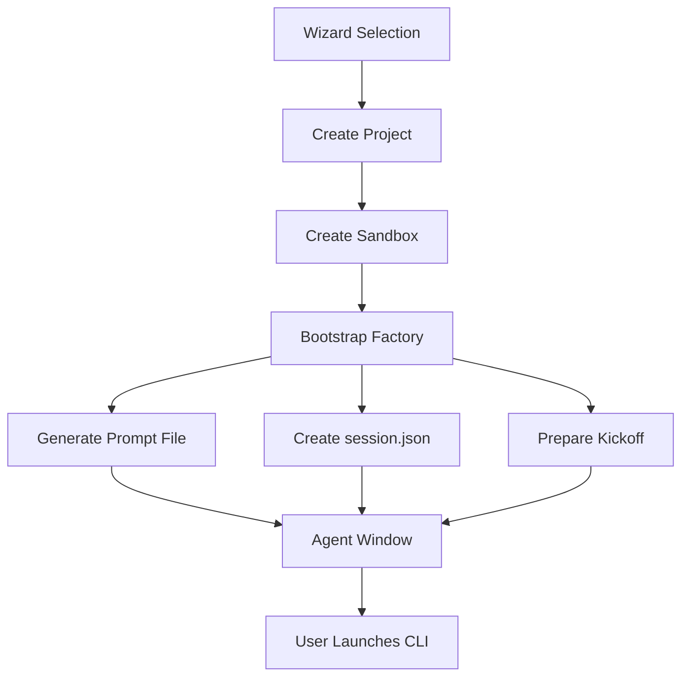

# DevBox Factory Orchestration Design

## Overview

The DevBox Factory Orchestration system creates AI-powered development sessions by combining:
- **Model Selection**: Claude Code, Codex (GPT-5), or Gemini CLI
- **Stack Selection**: Next.js, Vite+React, Vite+Vue, or SvelteKit
- **Purpose Selection**: Modern Web App, Backend API, Game Dev, Traditional Web, Static Site, or CLI

## Architecture

### Components

#### 1. Session Orchestrator Service (`src/orchestrator/sessionOrchestrator.ts`)

Pure functions for pattern resolution and session bootstrapping:

```typescript
interface FactoryPattern {
  model: string;
  stack: string;
  purpose: string;
  cliBinding: CLIBinding;
  stackConfig: StackConfig;
  purposeOverrides: PurposeOverrides;
}

// Core functions
resolvePattern(model, stack, purpose) → FactoryPattern
ensurePromptFile(binding, workdir, algorithm) → void
materializeScaffold(pattern) → Command[]
createStudioSession(pattern) → SessionConfig
```

#### 2. Agent Bootstrap Component (`src/agent/AgentBootstrap.tsx`)

Enhanced Agent window showing:
- CLI selection indicator
- Environment variable checklist
- Kickoff prompt with copy button
- Launch terminal button

#### 3. Prompt Templates

Dynamic templates generated at runtime:
- `.factory/claude.md` - Claude-specific instructions
- `.factory/codex.md` - Codex-specific instructions  
- `.factory/GEMINI.md` - Gemini-specific instructions

Each includes:
1. Agentic Application Factory Algorithm
2. Stack-specific bootstrap notes
3. Purpose-specific guidance
4. Output formatting rules

#### 4. Algorithm Document (`algorithm.md`)

Authoritative source for the Agentic Application Factory loop:
1. **Clarify** - Understand requirements
2. **Plan** - Design minimal architecture
3. **Retrieve** - Gather facts, no guessing
4. **Scaffold** - Create project structure
5. **Implement** - Build iteratively
6. **Test** - Verify each step
7. **Refine** - Apply DRY/KISS
8. **Finalize** - Deliver runnable code

## Data Flow



## Session Lifecycle

1. **Selection Phase**
   - User chooses Model, Stack, Purpose in wizard
   - Selections stored in project config

2. **Bootstrap Phase**
   - `bootstrapFactory()` called with selections
   - Pattern resolved from pattern-map.json
   - Algorithm and prompt files generated
   - Session metadata persisted

3. **Launch Phase**
   - Agent window displays checklist
   - User sets environment variables
   - User copies kickoff prompt
   - User launches CLI in terminal

4. **Execution Phase**
   - CLI reads prompt file
   - Follows factory algorithm
   - Builds application iteratively
   - Preview updates in real-time

## File Structure

```
/workspaces/{project-id}/
├── .factory/
│   ├── algorithm.md       # Factory algorithm (authoritative)
│   ├── claude.md          # Claude prompt (if selected)
│   ├── codex.md           # Codex prompt (if selected)
│   ├── GEMINI.md          # Gemini prompt (if selected)
│   ├── patterns.json      # Audit results
│   ├── pattern-map.json   # Pattern bindings
│   └── session.json       # Runtime selection
├── project.config.json    # Project metadata
├── SANDBOX_CONTEXT.md     # Sandbox guidelines
├── session.json           # Legacy session data
└── session.log            # Execution log
```

## Security & Constraints

- No automatic CLI execution without user consent
- Environment variables must be set by user
- No secrets stored in code or files
- Sandboxes run with limited CPU/memory
- Network access controlled by user

## Extensibility

New patterns can be added by:
1. Adding model to `cli_binding` in pattern-map.json
2. Adding stack to `stack_bootstrap` 
3. Adding purpose to `purpose_overrides`
4. Creating corresponding template in orchestrator

## Error Handling

- Missing templates fallback to blank
- Failed bootstraps log to session.log
- User can retry with different selections
- Partial failures don't block studio

## Testing Strategy

Verification script (`scripts/verify-factory.ts`) validates:
- Prompt file generation for each model
- Session.json creation and updates
- Kickoff prompt rendering
- Pattern resolution accuracy
- No destructive operations
